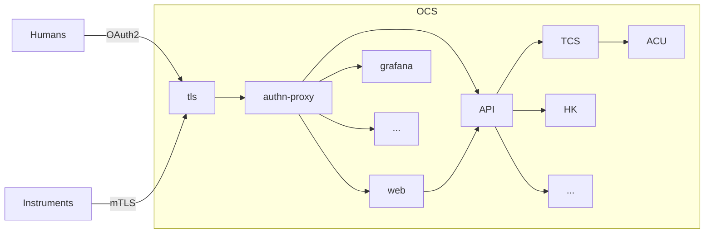

# Architecture

## Authentication

There are two ways for clients to authenticate themselves, depending on if they're human or software:

- *OAuth2 + GitHub IdP:* When a human visits the site, they'll be redirected to GitHub and prompted to login to their account. They'll then be asked to give FYST read-only access to their account metadata, and redirected back to the OCS.
- *mTLS:* Instrument schedulers and other software needing access to the API will be given a TLS certificate.
